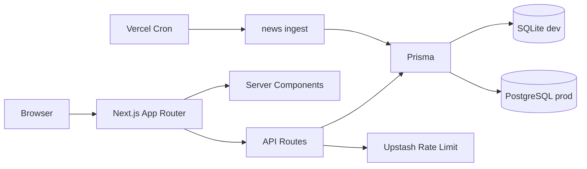

# 호케이 Hokei

호치민 거주 한국 교민을 위한 커뮤니티 포털 — 현지 뉴스, 구인·부동산·중고, 커뮤니티 게시판.

## 기술 스택

| 영역 | 기술 |
|------|------|
| 프론트 | Next.js 16, React 19, Tailwind 4 |
| 인증 | NextAuth v5 (이메일, Google) |
| DB | SQLite (기본) / PostgreSQL (선택) |
| ORM | Prisma 7 |
| 검색 | SQLite FTS5 (+ LIKE 폴백) |
| 모니터링 | Sentry (선택), Vercel Analytics |

## 빠른 시작 (Cursor 통합 터미널)

```bash
npm install
cp .env.example .env
# AUTH_SECRET: openssl rand -base64 32

npm run setup    # SQLite: 시드 + 검색 인덱스 (처음 한 번)
npm run dev      # http://localhost:3001
```

전체 명령 목록: **`npm run help`**

PostgreSQL: `npm run setup:pg` → [docs/DATABASE.md](docs/DATABASE.md)

http://localhost:3001

### 시드 계정

| 역할 | 이메일 | 비밀번호 |
|------|--------|----------|
| 관리자 | admin@hokei.vn | admin1234 |
| 회원 | demo@hokei.vn | demo1234 |

## 환경 변수 (필수·권장)

| 변수 | 설명 |
|------|------|
| `AUTH_SECRET` | NextAuth 시크릿 (32자+ 랜덤) |
| `DATABASE_URL` | `file:./dev.db` 또는 PostgreSQL URL |
| `NEXT_PUBLIC_SITE_URL` | `http://localhost:3001` |
| `CRON_SECRET` | 뉴스 Cron API 보호 (프로덕션 필수) |
| `NAVER_CLIENT_ID/SECRET` | 뉴스 수집 (권장) |
| `SENTRY_DSN` / `NEXT_PUBLIC_SENTRY_DSN` | Sentry 에러 모니터링 ([docs/SENTRY.md](docs/SENTRY.md)) |
| `UPSTASH_REDIS_REST_URL` / `UPSTASH_REDIS_REST_TOKEN` | 분산 Rate limit (Vercel 프로덕션 권장) |

전체 목록: `.env.example`

## 스크립트

`npm run help` 로 카테고리별 명령을 확인하세요.

| 명령 | 설명 |
|------|------|
| `npm run setup` | SQLite 초기 설정 |
| `npm run setup:pg` | PostgreSQL(Docker) 초기 설정 |
| `npm run dev` | 개발 서버 :3001 |
| `npm run check` | lint + test + build |
| `npm run verify` | 보안 헤더 + env 점검 |
| `npm run test:coverage` | Vitest 커버리지 |
| `npm run naver:test` | 네이버 API 키 확인 |
| `npm run search:pg:setup` | PG tsvector 검색 |
| `npm run db:migrate:sqlite-to-pg` | SQLite → PG 이전 |
| `npm run db:pg:generate` | PG Prisma Client (`.env`에 PG URL 필요) |

## 프로젝트 구조

```
src/
├── app/                 # App Router (페이지·API)
├── components/          # UI·레이아웃·글쓰기·댓글
├── lib/                 # posts, categories, search, auth
├── generated/prisma/    # Prisma Client
docs/DATABASE.md         # SQLite ↔ PostgreSQL
```

## API 엔드포인트 (요약)

| 메서드 | 경로 | 설명 |
|--------|------|------|
| POST | `/api/auth/signup` | 회원가입 |
| POST | `/api/posts/create` | 글 작성 |
| PATCH/DELETE | `/api/posts/[id]` | 글 수정·삭제 |
| GET/POST | `/api/posts/[id]/comments` | 댓글 목록·등록 |
| PATCH/DELETE | `/api/posts/[id]/comments/[commentId]` | 댓글 수정·삭제 |
| POST | `/api/uploads` | 첨부 업로드 |
| POST | `/api/posts/[id]/views` | 조회수 증가 |
| GET | `/api/cron/news` | 뉴스 수집 (Cron) |

응답 형식: `{ ok: true, ... }` / `{ ok: false, error: "..." }`

## 주요 기능

- 5대 섹션 (뉴스·부동산·벼룩시장·구인·커뮤니티) DB 카테고리
- 회원·비회원 글쓰기, 첨부, 댓글 CRUD
- 섹션별 글쓰기 (`/write?section=jobs` 등)
- FTS 검색 (`/search?q=`)
- 뉴스 자동 수집 (일 10건, 09:00 ICT)
- Rate limit (로컬: 메모리 · 프로덕션: Upstash Redis 선택), MIME 검증, 보안 헤더

## 배포 (Vercel)

```bash
npm run predeploy           # 배포 전 점검
npm run predeploy:prod      # 프로덕션 env 규칙 포함
npm run vercel:env          # Vercel 변수 체크리스트
```

상세: **[docs/DEPLOY.md](docs/DEPLOY.md)**

1. **PostgreSQL** + `BLOB_READ_WRITE_TOKEN` + `CRON_SECRET` + `AUTH_SECRET`
2. `npx prisma migrate deploy` 후 `npm run search:pg:setup`
3. Cron 09:00 ICT — `vercel.json` 참고

## 아키텍처 (요약)



## CI

GitHub Actions: `lint` → `test` → `build` → `e2e` (`.github/workflows/ci.yml`)

## 기여 (Contributing)

1. `npm run setup` 후 `npm run dev`
2. 변경 전 `npm run check` (lint + test + build)
3. API 추가 시 `{ ok, error? }` 형식·`enforcePreset` rate limit 준수
4. PR 설명에 스크린샷 또는 테스트 방법 포함

## 보안 체크리스트

```bash
npm run env:check          # 필수 변수 점검
npm run env:auth-secret    # AUTH_SECRET 재발급
npm run env:cron-secret    # CRON_SECRET 추가
```

- [ ] `.env`를 Git에 커밋하지 않기 (`.gitignore`에 포함됨)
- [ ] Vercel에 `AUTH_SECRET`, `CRON_SECRET`, `DATABASE_URL` 설정
- [ ] Sentry DSN 연결 (선택)
- [ ] 업로드 디렉터리 백업·용량 모니터링

## 라이선스

Private — 호케이 프로젝트 내부용
