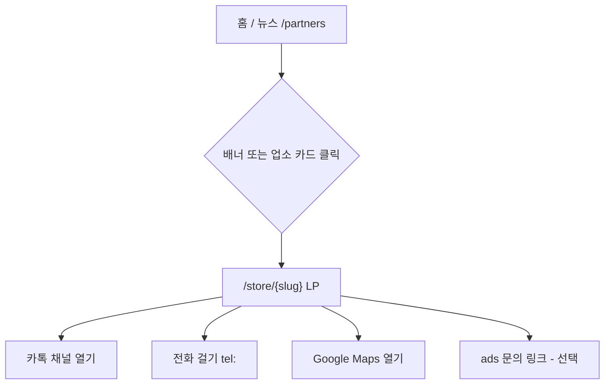

# User Flow — 업소 제휴 · 배너 · 모바일 LP

---

## Flow A — 교민 이용자 (배너 → LP)



**Must:** LP 진입 3초 이내 CTA 버튼 노출 (above fold on mobile)

---

## Flow B — 업소 사장님 (오프라인 영업)

```mermaid
flowchart TD
  S1[ads@hokei.vn 또는 문의 폼] --> S2[운영자 미팅·자료 수집]
  S2 --> S3[관리자가 PartnerStore 등록]
  S3 --> S4[LP URL 전달: hokei.vn/store/xxx]
  S4 --> S5[사장님이 카톡·전단에 링크 게시]
  S3 --> S6[배너 활성화 - 유료 플랜]
  S6 --> S1
```

---

## Flow C — 운영자 (관리자)

```mermaid
flowchart TD
  M1[/admin/partners] --> M2[새 업소 등록]
  M2 --> M3[slug 자동 생성·중복 확인]
  M3 --> M4[썸네일 업로드]
  M4 --> M5[상태 Published]
  M5 --> M6[배너 슬롯 연결 - optional]
  M5 --> M7[사장님에게 URL 공유]
  M1 --> M8[만료/비노출 처리]
```

---

## Flow D — `/partners` 허브

```mermaid
flowchart TD
  P1[/partners] --> P2[카테고리 필터 - Phase 2]
  P1 --> P3[업소 카드 그리드]
  P3 --> P4[/store/slug]
  P1 --> P5[하단: 광고 문의 CTA → /contact?kind=ads]
```

---

## 예외·엣지

| 상황 | 동작 |
|------|------|
| slug 없음 / expired | 404 |
| 카톡 URL 없음 | 카톡 버튼 숨김, 전화·지도만 |
| draft 상태 | 공개 404, admin만 preview (Phase 2) |
